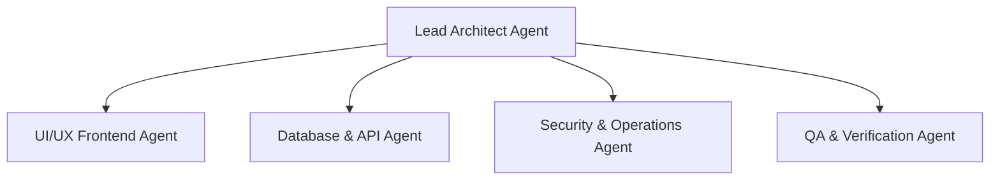

# EVM Developer & Setup Guide

This document outlines the technical framework, system architecture, directory structures, and setup instructions for engineers developing the **Excellence Voices Management (EVM)** application.

---

## 1. Technical Stack Selection

Based on the requirements (internal utility, lightweight database needs, high visual standards), the recommended technical architecture is:

### Frontend Layer
* **Framework**: React (using Vite for ultra-fast development) or a modern Single Page Application (SPA).
* **Styling**: Vanilla CSS utilizing Custom Properties (CSS variables) to support dark mode, glassmorphism UI styling, micro-animations, and fluid responsive grids.
* **Typography**: Modern sans-serif fonts loaded from Google Fonts (e.g., `Outfit` or `Inter`).
* **Icons**: Feather Icons or FontAwesome SVG icons.

### Database & Backend Layer
* **Storage Engine**: Google Sheets (utilizing the 8 sheets detailed in the schema).
* **API Connector Options**:
  1. **Google Apps Script Web App (GAS)**: A custom Apps Script deployed as a Web App URL. It serves as a secure proxy executing HTTP `POST`/`GET` requests, parsing queries, and updating Google Sheets without exposing Google API credentials on the client side.
  2. **Direct Google Sheets API v4**: Utilizes official Google Cloud APIs (requires OAuth2 authentication or service account configuration).

---

## 2. Recommended Directory Structure

```
excellence-voices-management/
├── docs/                        # Project Specifications & Manuals
│   ├── database_schema.md       # Google Sheets column structures
│   ├── business_logic.md        # Mathematical calculation logic
│   ├── user_guide_permissions.md# Role mapping & User matrix
│   └── developer_guide.md       # (This file) Developer guidelines
├── public/                      # Static assets & icons
└── src/
    ├── assets/                  # CSS styles, base themes, global typography
    │   └── index.css            # Base design system & token definitions
    ├── components/              # Reusable UI widgets
    │   ├── Sidebar.jsx          # Left-hand navigation
    │   ├── MetricCard.jsx       # Financial display modules
    │   └── TransactionTable.jsx # Clean data grids
    ├── context/                 # Context management
    │   └── AuthContext.jsx      # Global security & role-based checks
    ├── services/                # Backend / API connectors
    │   └── googleSheetsApi.js   # Connector service communicating with sheets
    ├── views/                   # Views / Pages
    │   ├── Dashboard.jsx
    │   ├── Schools.jsx
    │   ├── Trainers.jsx
    │   ├── Expenses.jsx
    │   ├── CapitalContributions.jsx
    │   ├── Reports.jsx
    │   └── ActivityLogs.jsx
    ├── App.jsx                  # Main routing and entry wrapper
    └── main.jsx                 # Bootstrap loader
```

---

## 3. Google Sheets Integration Service (Design Pattern)

To communicate with the Google Sheets database, the application utilizes a centralized service class. Below is the proposed design pattern using Google Apps Script as the proxy.

### Apps Script Proxy Code (`Code.gs`)
```javascript
function doGet(e) {
  var sheetName = e.parameter.sheet;
  var action = e.parameter.action;
  
  if (action === "readAll") {
    return ContentService.createTextOutput(JSON.stringify(readSheetData(sheetName)))
      .setMimeType(ContentService.MimeType.JSON);
  }
}

function doPost(e) {
  var params = JSON.parse(e.postData.contents);
  var sheetName = params.sheet;
  var action = params.action;
  
  if (action === "addRow") {
    return ContentService.createTextOutput(JSON.stringify(addRowToSheet(sheetName, params.data)))
      .setMimeType(ContentService.MimeType.JSON);
  }
}
```

### Client Service Connector (`src/services/googleSheetsApi.js`)
```javascript
const BACKEND_URL = "https://script.google.com/macros/s/YOUR_DEPLOYMENT_ID/exec";

export async function fetchSheetData(sheetName) {
  const response = await fetch(`${BACKEND_URL}?sheet=${sheetName}&action=readAll`);
  if (!response.ok) throw new Error(`Failed to fetch data for ${sheetName}`);
  return response.json();
}

export async function insertRow(sheetName, rowData) {
  const response = await fetch(BACKEND_URL, {
    method: "POST",
    headers: { "Content-Type": "application/json" },
    body: JSON.stringify({ sheet: sheetName, action: "addRow", data: rowData }),
  });
  if (!response.ok) throw new Error(`Failed to insert record into ${sheetName}`);
  return response.json();
}
```

---

## 4. UI Design Standards & Styling Guide

To provide a premium feel, the application must implement a unified design theme:

### Color Palette (Glassmorphism & Cool Slate)
* **Background**: Cool Slate `#0F172A` (deep dark mode theme).
* **Card Panels**: Translucent background `#1E293B` with `backdrop-filter: blur(12px)` and a subtle light border of `rgba(255, 255, 255, 0.05)`.
* **Accent Colors**: 
  * Vibrant Cyan: `#06B6D4` (Revenue highlights).
  * Emerald Green: `#10B981` (Profit & active statuses).
  * Electric Violet: `#8B5CF6` (Trainer metrics & controls).
  * Rose Pink: `#F43F5E` (Outstanding balances & reminders).

### Interactive Hover & Transition Effects
All buttons, sidebar selections, and tables should transition smoothly:
```css
.interactive-element {
  transition: all 0.3s cubic-bezier(0.4, 0, 0.2, 1);
}

.interactive-element:hover {
  transform: translateY(-2px);
  box-shadow: 0 10px 15px -3px rgba(0, 0, 0, 0.3);
}
```

---

## 5. Security & Session Storage
Since authentication is verified against the `Users` sheet, the client application follows these authentication rules:
1. **Local State Check**: On load, check `sessionStorage` (or encrypted `localStorage`) for a token/valid user configuration containing email and role.
2. **Path Protection**: React routing rules block pages if session configuration is absent, redirecting to the `/login` screen.
3. **Write Actions Defense**: Double-check the user's role on edit operations (`Partner 1` or `Manager` allowed; `Partner 2` or `Partner 3` blocked).

---

## 6. Implementation of Data Maintenance Tasks (Google Apps Script)

To realize the lifecycle operations requested for **Google Sheets Backups, Excel Exports, and Archiving**, the following code modules should be implemented in the Apps Script project (`Code.gs`):

### A. Daily Backup Script
Set up a daily time-driven trigger executing `runDailyBackup()`:
```javascript
function runDailyBackup() {
  var activeSpreadsheet = SpreadsheetApp.getActiveSpreadsheet();
  var backupFolderId = "YOUR_BACKUPS_FOLDER_ID";
  var folder = DriveApp.getFolderById(backupFolderId);
  
  var dateString = Utilities.formatDate(new Date(), "GMT+5:30", "yyyy-MM-dd");
  var backupName = "EVM_Backup_" + dateString;
  
  // Create copy
  var backupFile = DriveApp.getFileById(activeSpreadsheet.getId()).makeCopy(backupName, folder);
  
  // Cleanup backups older than 30 days
  var files = folder.getFiles();
  var backupList = [];
  while (files.hasNext()) {
    var file = files.next();
    if (file.getName().indexOf("EVM_Backup_") === 0) {
      backupList.push(file);
    }
  }
  
  // Sort and remove old files
  if (backupList.length > 30) {
    backupList.sort(function(a, b) {
      return a.getDateCreated() - b.getDateCreated();
    });
    while (backupList.length > 30) {
      var oldFile = backupList.shift();
      oldFile.setTrashed(true);
    }
  }
}
```

### B. Weekly Excel Export Script
Set up a weekly time-driven trigger (every Sunday night) executing `runWeeklyExcelExport()`:
```javascript
function runWeeklyExcelExport() {
  var spreadsheetId = SpreadsheetApp.getActiveSpreadsheet().getId();
  var exportFolderId = "YOUR_EXPORTS_FOLDER_ID";
  var folder = DriveApp.getFolderById(exportFolderId);
  
  var dateString = Utilities.formatDate(new Date(), "GMT+5:30", "yyyy-MM-ww");
  var fileName = "EVM_Weekly_Export_" + dateString + ".xlsx";
  
  // Fetch XLSX download URL
  var url = "https://docs.google.com/spreadsheets/d/" + spreadsheetId + "/export?format=xlsx";
  var response = UrlFetchApp.fetch(url, {
    headers: {
      'Authorization': 'Bearer ' +  ScriptApp.getOAuthToken()
    },
    muteHttpExceptions: true
  });
  
  if (response.getResponseCode() === 200) {
    var blob = response.getBlob().setName(fileName);
    folder.createFile(blob);
  }
}
```

### C. Row Archiving Function
Expose an API handler to perform archiving from the front-end application:
```javascript
function archiveRecord(sheetName, recordId, userId) {
  var ss = SpreadsheetApp.getActiveSpreadsheet();
  var sourceSheet = ss.getSheetByName(sheetName);
  var archiveSheet = ss.getSheetByName("Archive_" + sheetName);
  
  if (!sourceSheet || !archiveSheet) {
    throw new Error("Sheet or archive sheet not found.");
  }
  
  var data = sourceSheet.getDataRange().getValues();
  var headers = data[0];
  var idColIndex = headers.indexOf("school_id"); // Or relevant primary key column
  
  for (var i = 1; i < data.length; i++) {
    if (data[i][idColIndex] === recordId) {
      var rowValues = data[i];
      
      // Append archiving metadata: date and user
      var archiveRow = rowValues.concat([new Date(), userId]);
      archiveSheet.appendRow(archiveRow);
      
      // Remove original row
      sourceSheet.deleteRow(i + 1);
      return { success: true };
    }
  }
  return { success: false, error: "Record ID not found." };
}
```

---

## 7. Multi-Agent Development Team & Delegation Model

To optimize construction speed and quality, we segment development responsibilities across specialized AI Subagents. Each agent operates with specific roles, scope controls, and quality checklists.



### Specialized Agents & Roles

#### 1. UI/UX Frontend Agent (Agent-UI)
* **Role**: Owns the visual presentation layer, navigation layouts, and client-side page views.
* **Scope**: Builds responsive pages using dark-slate glassmorphism styles, CSS variable systems, and standard navigation sidebars.
* **Scope Defense**: Must not design or implement any tables or pages related to student profiles, classroom seats, or attendance.

#### 2. Database & API Agent (Agent-DB)
* **Role**: Owns the Google Sheets proxy API, Google Apps Script code sheets, and client-side database connector methods.
* **Scope**: Ensures correct mapping of row variables, schema constraints, and primary keys for the 8 sheet tables.

#### 3. Security & Operations Agent (Agent-SecOps)
* **Role**: Protects endpoints, manages user levels (Partner 1/Manager vs. Partner 2/3), audit log writes, time-driven backup folders, and sheet archiving scripts.
* **Scope**: Implements session state variables and verifies triggers for daily duplicates and weekly Excel exports.

#### 4. QA & Verification Agent (Agent-QA)
* **Role**: Runs unit tests on mathematical dashboard KPI calculation formulas, and tests manual WhatsApp pre-fills.


