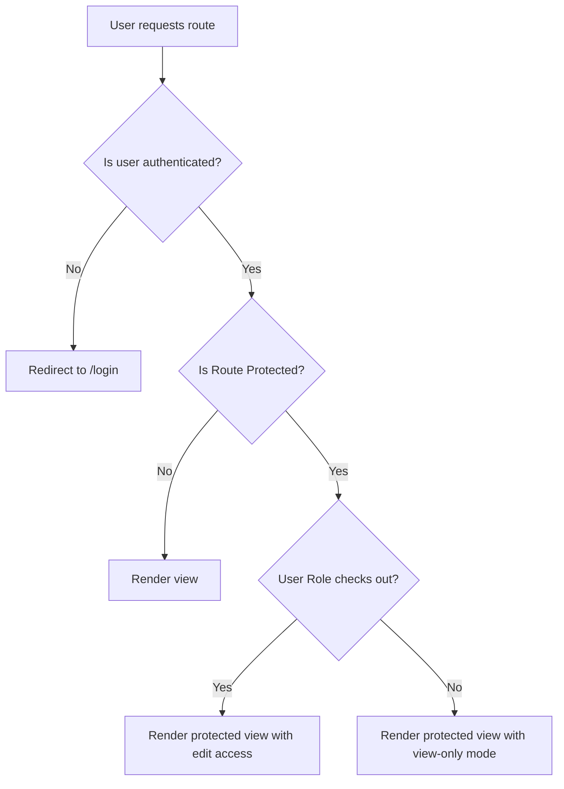
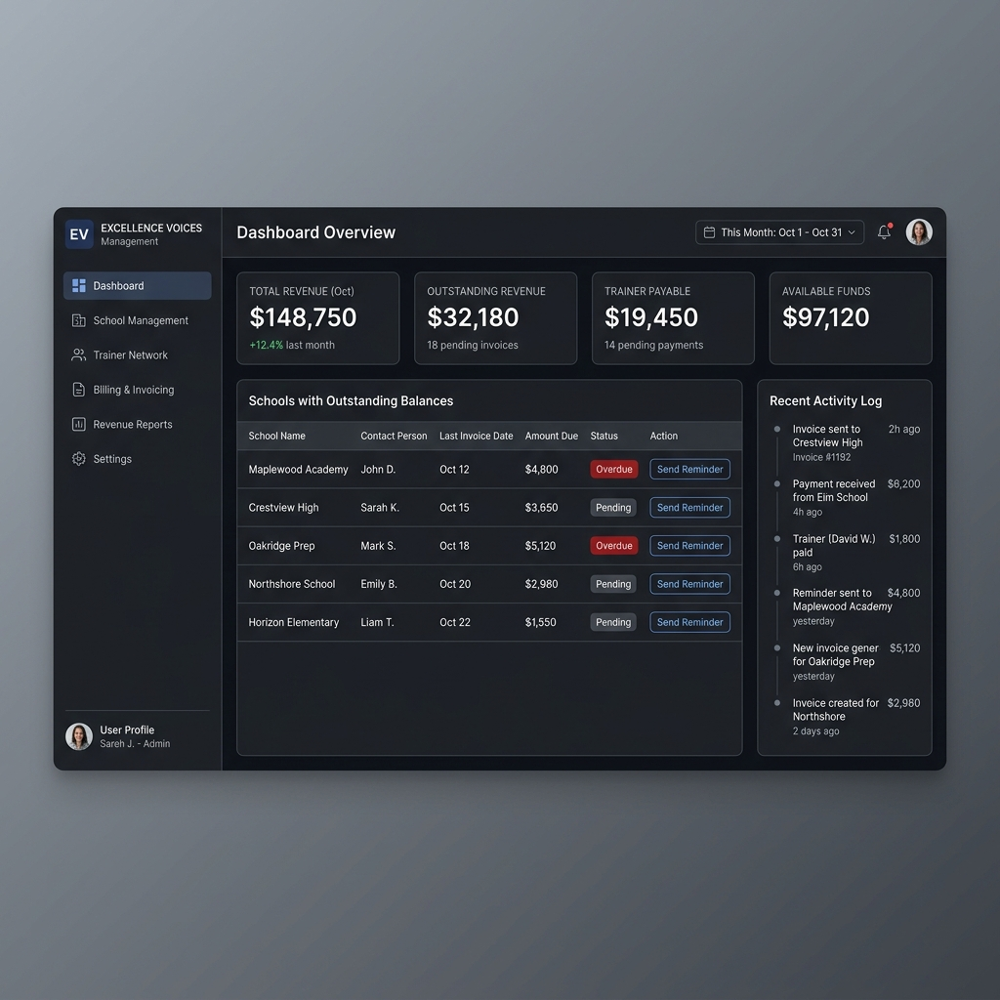
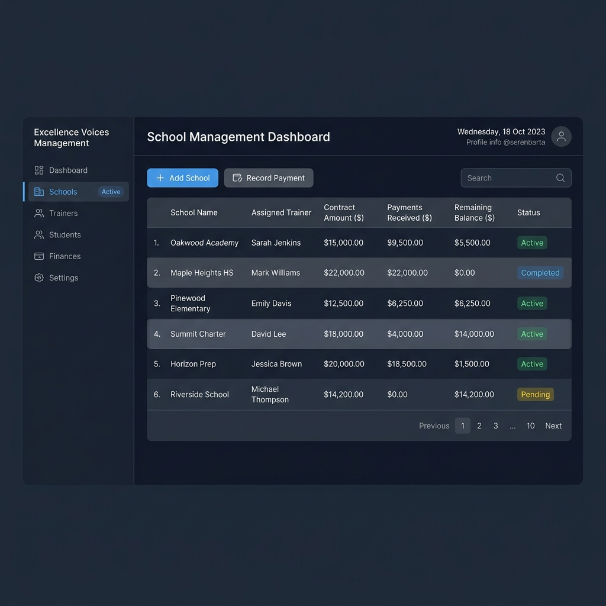

# EVM Wireframes & Navigation Routing Specification

This document details the user interface wireframes, screen layouts, and front-end navigation routing map for the **Excellence Voices Management (EVM)** application.

---

## 1. Routing Table & Route Guards

The front-end is configured as a Single Page Application (SPA) with a router (e.g. React Router) controlling page transitions.

### Route Permissions Table

| Route Path | View/Component | Access Level | Permitted Roles | Description |
| :--- | :--- | :--- | :--- | :--- |
| `/login` | `LoginView` | Public | Unauthenticated | Login screen with email & password check. |
| `/` | `DashboardView` | Protected | All Roles | Landing page with metric cards, alerts, and charts. |
| `/schools` | `SchoolsListView` | Protected | All Roles | Directory of schools with search and key metrics. |
| `/schools/:id`| `SchoolDetailsView`| Protected | All Roles | Details of a single school, balance logs, and payment histories. |
| `/trainers` | `TrainersListView`| Protected | All Roles | Directory of trainers. |
| `/trainers/:id`| `TrainerDetailsView`|Protected | All Roles | Trainer contract details, assigned schools, and payment ledger. |
| `/expenses` | `ExpensesView` | Protected | All Roles | Register and view categorized operational expenses. |
| `/capital` | `CapitalView` | Protected | All Roles | Log partner capital contributions. |
| `/reports` | `ReportsHubView` | Protected | All Roles | Reports generator view. |
| `/logs` | `ActivityLogsView` | Protected | All Roles | Complete system audit logs. |
| `/settings` | `SettingsView` | Protected | All Roles | Application and user profile configurations. |

### Routing Guard Logic Flow



---

## 2. Text-Based Wireframe Layouts

### Dashboard Screen Layout (`/`)
```
+------------------------------------------------------------------------------------------------+
|  [EVM LOGO]   | Welcome, Manager (Edit Mode)                                     [Settings] [U] |
+---------------+--------------------------------------------------------------------------------+
| [DASHBOARD]   |  FINANCIAL KPIs                                                                |
| [Schools]     |  +------------------+  +------------------+  +------------------+  +---------+ |
| [Trainers]    |  | Total Revenue    |  | Outstanding Rev. |  | Trainer Payable  |  | Cash    | |
| [Expenses]    |  | $150,000         |  | $45,000          |  | $12,500          |  | $82,400 | |
| [Capital]     |  +------------------+  +------------------+  +------------------+  +---------+ |
| [Reports]     |                                                                                |
| [Audit Logs]  |  ALERTS: OUTSTANDING BALANCES                                                  |
|               |  +--------------------------+-------------------+-----------------+----------+ |
| [LOGOUT]      |  | School Name              | Contract Balance  | Assigned Trainer| Action   | |
|               |  +--------------------------+-------------------+-----------------+----------+ |
|               |  | Green Valley School      | $5,000            | John Doe        | [Send]   | |
|               |  | Oakridge Academy         | $2,400            | Jane Smith      | [Send]   | |
|               |  +--------------------------+-------------------+-----------------+----------+ |
|               |                                                                                |
|               |  RECENT ACTIVITIES (Latest 10)                                                 |
|               |  - [09:15 AM] Manager updated Green Valley School contract.                    |
|               |  - [08:30 AM] Partner 1 registered a School Payment of $1,200.                 |
+------------------------------------------------------------------------------------------------+
```

### School Details Screen Layout (`/schools/:id`)
```
+------------------------------------------------------------------------------------------------+
|  [EVM LOGO]   | School Profile: Green Valley Academy                             [Back to List] |
+---------------+--------------------------------------------------------------------------------+
| [DASHBOARD]   |  PROFILE SUMMARY                                 [Edit Info] [Archive School]  |
| [Schools]     |  - Principal: Dr. Robert Vance        - Contract Value: $50,000                |
| [Trainers]    |  - Coordinator: Sarah Jenkins         - Received to Date: $45,000               |
| [Expenses]    |  - Contact No: +91 98765 43210        - Balance Owed: $5,000                   |
| [Capital]     |  - Assigned Trainer: John Doe         - Status: Active                         |
| [Reports]     |                                                                                |
| [Audit Logs]  |  PAYMENTS TRANSACTIONS                                                         |
|               |  +------------+----------+-----------------+-----------------------+---------+ |
| [LOGOUT]      |  | Date       | Amount   | Month Cover     | Remarks               | By      | |
|               |  +------------+----------+-----------------+-----------------------+---------+ |
|               |  | 2026-05-10 | $10,000  | May 2026        | 3rd Installment       | Partner1| |
|               |  | 2026-04-12 | $20,000  | Mar, Apr 2026   | Bundled Payment       | Manager | |
|               |  +------------+----------+-----------------+-----------------------+---------+ |
|               |                                                                                |
|               |  [ + Record Payment ]                                                          |
+------------------------------------------------------------------------------------------------+
```

---

## 3. High-Fidelity UI Mockups

### Dashboard Page UI


### School Management UI


